# Glint Architecture & System Design Documentation

This document provides a comprehensive technical overview of **Glint**, detailing its high-level architecture, low-level component design, execution lifecycles, data contracts, and directory structure.

---

## 1. Directory Structure

```text
Glint/
├── .gitignore                      # Git ignore rules for node_modules and .env files
├── .npmrc                          # Root npm configuration (legacy-peer-deps=true)
├── architecture.md                 # System architecture and technical design specification
├── Glint.md                        # Project analysis, issue resolutions, and audit log
├── package.json                    # Workspace root scripts (client and server orchestration)
├── README.md                       # Project overview, installation, and user documentation
│
├── client/                         # React Frontend Application
│   ├── .npmrc                      # Client-specific npm configuration
│   ├── package.json                # Frontend dependencies and run scripts
│   ├── package-lock.json           # Client dependency lockfile
│   ├── tailwind.config.js          # Tailwind CSS design system tokens (Postman dark palette)
│   │
│   ├── public/
│   │   ├── favicon.ico             # App icon
│   │   ├── index.html              # HTML template with Inter and JetBrains Mono typography
│   │   ├── logo192.png             # Mobile app icon (192px)
│   │   └── manifest.json           # Web app manifest configuration
│   │
│   └── src/
│       ├── App.jsx                 # Central application state manager & workbench container
│       ├── index.js                # React DOM entrypoint (StrictMode & ThemeProvider mount)
│       ├── index.css               # Global CSS, scrollbar styles, and component utility classes
│       │
│       ├── components/
│       │   ├── AISuggestion.jsx    # Markdown renderer for Gemini AI diagnostic recommendations
│       │   ├── BodyEditor.jsx      # Monospace JSON payload editor with validation & format tools
│       │   ├── HeadersInput.jsx    # Key-value header table with datalist presets
│       │   ├── Icons.jsx           # Clean, accessible inline SVG icon library
│       │   ├── MethodSelector.jsx  # HTTP verb dropdown with Postman color coding
│       │   ├── RequestHistory.jsx  # Slide-over drawer for searching and restoring requests
│       │   ├── ResponseViewer.jsx  # Split response viewer (Pretty, Raw, Headers, AI diagnostics)
│       │   ├── ThemeToggle.jsx     # Dark/Light theme mode switch button
│       │   └── UrlInput.jsx        # Monospace endpoint input with shortcut handlers
│       │
│       ├── context/
│       │   └── ThemeContext.jsx    # React Context for system/local theme state persistence
│       │
│       └── utils/
│           ├── apiCaller.js        # Dual-mode HTTP client (Direct Axios vs. Server Proxy)
│           └── helpers.js          # String validators (URL, JSON), formatters, and sample APIs
│
└── server/                         # Express Backend Application
    ├── .env                        # Environment secrets (PORT, GEMINI_API_KEY, GEMINI_MODEL)
    ├── index.js                    # Server initialization, middleware, routes, and error handling
    ├── package.json                # Server dependencies and runner scripts
    ├── package-lock.json           # Server dependency lockfile
    │
    ├── controllers/
    │   ├── aiController.js         # Gemini API integration, prompt generation & fallback rotation
    │   └── requestController.js    # Proxy request executor & optional CRUD request persistence
    │
    ├── middleware/
    │   └── errorHandler.js         # Centralized Express error handler (Mongoose & system errors)
    │
    ├── models/
    │   ├── Request.js              # Mongoose schema for saved request configurations
    │   └── User.js                 # Mongoose schema for user identity and JWT authentication
    │
    └── routes/
        ├── ai.js                   # Route definitions for AI diagnostics (/api/ai/suggest)
        └── requestRoutes.js        # Route definitions for proxy (/execute) and requests CRUD
```

---

## 2. High-Level Architecture

Glint follows a decoupled client-server architecture designed for fast, local-first API development and automated AI debugging:

```mermaid
graph TB
    subgraph Browser["Client Workspace (Port 3000)"]
        UI["React 18 Workbench UI"]
        State["Application State (App.jsx)"]
        LocalStorage[("Browser LocalStorage")]
        AxiosClient["Browser HTTP Client (Axios)"]
    end

    subgraph Backend["Express Server (Port 5000)"]
        Router["Express Router (/api/*)"]
        ProxyEngine["Proxy Controller (requestController.js)"]
        AIEngine["AI Diagnostics Controller (aiController.js)"]
        DBLayer["Mongoose Models (Optional DB)"]
    end

    subgraph External["External Ecosystem"]
        TargetAPI["Target HTTP Server / API"]
        GeminiAPI["Google Gemini AI API (gemini-3.1-flash-lite)"]
        MongoDB[("MongoDB Database (Optional)")]
    end

    %% Client Interactions
    UI -->|User Inputs| State
    State -->|Persist History| LocalStorage
    LocalStorage -->|Restore Request| State

    %% Request Execution Paths
    State -->|Direct Mode| AxiosClient
    State -->|Proxy Mode / CORS Bypass| Router

    AxiosClient -->|Direct Request| TargetAPI
    TargetAPI -->|HTTP Response| AxiosClient
    AxiosClient -->|Response Data & Metadata| State

    Router -->|POST /api/request/execute| ProxyEngine
    ProxyEngine -->|Server-side Request (No CORS)| TargetAPI
    TargetAPI -->|Raw Response| ProxyEngine
    ProxyEngine -->|Normalized Response Payload| State

    %% AI Diagnostic Flow
    State -->|Status >= 400 or Manual Ask| Router
    Router -->|POST /api/ai/suggest| AIEngine
    AIEngine -->|Structured Context Prompt| GeminiAPI
    GeminiAPI -->|Remediation Diagnosis| AIEngine
    AIEngine -->|Diagnostic Advice| UI

    %% Database
    Router -.->|Optional CRUD| DBLayer
    DBLayer -.->|Mongoose ODM| MongoDB
```

### Architectural Highlights
1. **Decoupled Client & Server**: The frontend runs independently on port 3000 and the backend runs on port 5000, connected through Create React App's reverse proxy in development.
2. **Dual-Mode Request Dispatcher**:
   - **Direct Mode**: The browser issues requests directly via `axios`. Fast, with direct support for local network servers.
   - **Proxy Mode**: Requests are forwarded to `POST /api/request/execute` on the Express server. The server executes the request server-side, bypassing all browser CORS restrictions (`Access-Control-Allow-Origin`).
3. **Stateless AI Diagnostic Loop**: Failed requests (`status >= 400`) package their endpoint, method, headers, request body, and response payload to generate tailored technical remediation advice via Google Gemini.
4. **Resilient Local Persistence**: Request history is stored locally in `window.localStorage` with a 50-item rolling window, requiring zero database setup for standard daily use.

---

## 3. Low-Level Component Architecture (Frontend)

```mermaid
graph TD
    App["App.jsx (State Root)"]
    
    App --> Header["Header Toolbar"]
    Header --> Brand["Brand Title & Version"]
    Header --> TemplatesBtn["Templates Popover Trigger"]
    Header --> HistoryBtn["History Drawer Trigger"]
    Header --> ThemeToggle["ThemeToggle.jsx"]

    App --> CommandBar["Unified Address Bar"]
    CommandBar --> MethodSelector["MethodSelector.jsx (GET, POST, etc.)"]
    CommandBar --> UrlInput["UrlInput.jsx (Endpoint Input)"]
    CommandBar --> SendBtn["Send Request Button"]
    CommandBar --> ProxyToggle["Server Proxy Checkbox"]

    App --> RequestTabs["Request Configuration Tabs"]
    RequestTabs --> HeadersInput["HeadersInput.jsx (Key-Value Grid)"]
    RequestTabs --> BodyEditor["BodyEditor.jsx (Raw JSON Editor)"]

    App --> ResponseViewer["ResponseViewer.jsx"]
    ResponseViewer --> StatusToolbar["Status & Latency Bar"]
    ResponseViewer --> ResponseTabs["Tabs: Body (Pretty/Raw), Headers, AI"]
    ResponseViewer --> ReactJson["ReactJson View Tree"]
    ResponseViewer --> AISuggestion["AISuggestion.jsx (Gemini Markdown)"]

    App --> RequestHistory["RequestHistory.jsx (Slide-over Drawer)"]
```



### State Management Flow (`client/src/App.jsx`)
- **Address & Payload State**:
  - `url`: String endpoint.
  - `method`: HTTP verb (`GET`, `POST`, `PUT`, `DELETE`, `PATCH`, `HEAD`, `OPTIONS`).
  - `headers`: Array of `{ key: string, value: string }` objects.
  - `body`: Stringified JSON payload.
- **Execution State**:
  - `isLoading`: Boolean indicating active in-flight request.
  - `response`: Normalized response object `{ data, status, statusText, headers, duration, url, method, requestHeaders, requestBody }`.
  - `error`: Error payload capturing HTTP errors or network timeouts.
- **Utility State**:
  - `useProxy`: Boolean toggling direct browser dispatch vs. server proxy execution.
  - `history`: Array of past request objects, synchronized with `localStorage`.

---

## 4. Low-Level Component Architecture (Backend)

### 1. Request Pipeline & Middleware Stack
```text
Inbound HTTP Request
       │
       ▼
[express.json()]           Parses incoming application/json payloads
       │
       ▼
[cors()]                   Permits cross-origin requests from http://localhost:3000
       │
       ▼
[Express Routes]           Dispatches to /api/request/* or /api/ai/*
       │
       ▼
[errorHandler.js]          Centralized catch-all handler for cast, validation, or server errors
```

### 2. AI Diagnostics Engine (`server/controllers/aiController.js`)
When an endpoint fails or a user triggers manual diagnostics, `aiController.getSuggestion` executes:
1. **Extraction**: Reads `{ url, method, headers, body, responseStatus, responseData }` from the request body.
2. **Prompt Formulation**: Compiles a prompt framing Gemini as an API debugging expert.
3. **Model Selection & Resilient Fallback**:
   - Primary Model: `gemini-3.1-flash-lite` (configured in `.env`).
   - Fallback Sequence: `["gemini-3.8-flash", "gemini-3.5-flash", "gemini-3.1-flash-lite-preview"]`.
   - If the primary model experiences high-demand spikes (HTTP 503) or rate limits, the controller automatically tries the next model in sequence before failing.
4. **Structured Markdown Response**: Returns `{ suggestion: string }` to the client for rendering via `react-markdown`.

### 3. Server Proxy Engine (`server/controllers/requestController.js`)
To circumvent browser CORS restrictions:
- Endpoint: `POST /api/request/execute`.
- Payload: `{ url, method, headers, body }`.
- Execution: Express performs a server-to-server call using `axios` with `validateStatus: () => true` so that all status codes (2xx, 3xx, 4xx, 5xx) are captured and returned cleanly to the client without throwing unhandled exceptions.

---

## 5. Data Contracts & Interfaces

### 1. Normalized Client-Server Response Object
```typescript
interface NormalizedApiResponse {
  data: any;                     // Parsed JSON or string body
  status: number;                // HTTP status code (e.g. 200, 404, 500)
  statusText: string;            // HTTP status description (e.g. 'OK', 'Not Found')
  headers: Record<string, string>; // Response headers key-value map
  duration: number;              // Round-trip latency in milliseconds
  url: string;                   // Request URL
  method: string;                // Request HTTP method
  requestHeaders: Record<string, string>; // Sent request headers
  requestBody: any;              // Sent request body
  isError?: boolean;             // Flag indicating HTTP 4xx or 5xx
}
```

### 2. AI Diagnostics Request Payload
```typescript
interface AIDiagnosticRequest {
  url: string;
  method: string;
  headers: Record<string, string>;
  body: any;
  responseStatus: number;
  responseData: any;
}
```

### 3. Request History Storage Schema (`localStorage`)
```typescript
interface HistoryItem {
  id: string;                    // Timestamp identifier
  timestamp: number;             // Unix timestamp in ms
  url: string;                   // Target URL
  method: string;                // HTTP verb
  headers: Array<{ key: string; value: string }>;
  body: any;
  status: number | string;       // HTTP code or 'ERR'
  duration: number;              // Execution duration in ms
}
```

---

## 6. Security & Environmental Configuration

- **API Keys**: Kept server-side in `server/.env` under `GEMINI_API_KEY`. The client never has access to the raw Gemini key.
- **CORS Protection**: The Express server restricts CORS origins to `http://localhost:3000` by default (configurable via `CORS_ORIGIN` in `.env`).
- **Dependency Isolation**: `.npmrc` files in both the root and `client/` directories configure `legacy-peer-deps=true` to guarantee cross-compatibility between React 18 and older peer dependencies (`react-json-view`).
- **Crash Prevention**: `process.on('unhandledRejection')` logs unexpected asynchronous errors without abruptly terminating the Express process.
